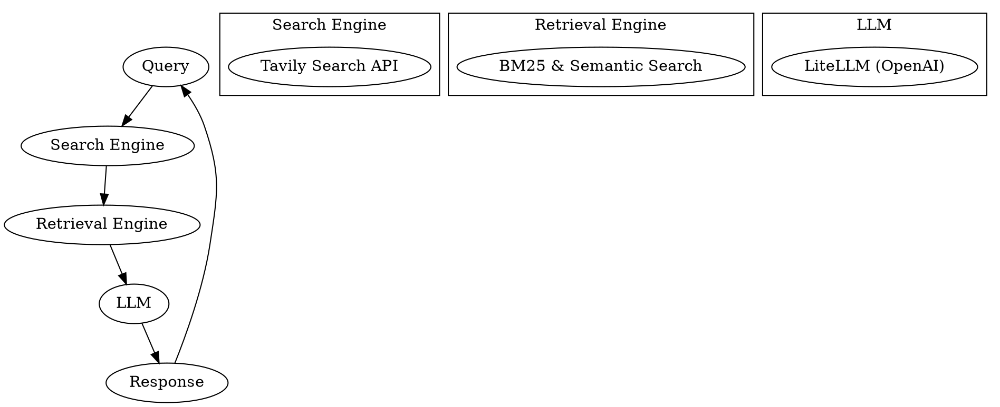

# Pravāha - Your Local Perplexity-Inspired Search Engine

**Introduction:**

Pravāha is your personal AI search assistant, bringing the power of a local search engine right to your fingertips. Inspired by Perplexity.ai, Pravāha lets you explore the fascinating world of Retrieval Augmented Generation (RAG) by combining cutting-edge search technology with the intelligence of Large Language Models (LLMs).

**Goal:**

Our mission is to empower users with a local, customizable, and insightful search experience. Pravāha aims to replicate the core functionality of popular search assistants like Perplexity, allowing you to delve deeper into information retrieval and language models.

**Explore the World of RAG:**

With Pravāha, you can witness firsthand how search engines and LLMs work in harmony. By understanding the underlying mechanisms of RAG, you can gain valuable insights into the future of information retrieval and AI-powered search.

**In Progress & Future Enhancements:**

Pravāha is constantly evolving! We are actively working on exciting new features, including:

* **Streaming Responses:** Experience real-time search results as they are generated.
* **Expanded Search Tool Support:** Integrate with more search providers for a wider range of sources.
* **Advanced Rerankers:** Improve the relevance and accuracy of search results.
* **Persistent Storage with DuckDB:** Store and manage your search history and data locally.
* **Agentic RAG with LangGraph:** Explore the potential of agentic search and knowledge graphs.

**Name Inspiration:**

The name **Pravāha** (प्रवाह) is derived from Sanskrit, meaning "flow." This reflects the project's goal of creating a seamless flow of information and responses, allowing users to navigate through queries and context effortlessly. Just as a river flows smoothly, Pravāha aims to provide a fluid and intuitive search experience.

**System Architecture:**



## Getting Started

1. **Clone the repository**:
    ```sh
    git clone https://github.com/jayshah5696/pravaha.git
    cd pravaha
    ```

2. **Install dependencies**:
    ```sh
    pip install -r requirements.txt
    ```

3. **Set up environment variables**:
    Create a `.env` file in the root directory and add your API keys:
    ```env
    TVLY_API_KEY=your_tavily_api_key
    OPENAI_API_KEY=your_openai_api_key
    ```

4. **Run the application**:
    ```sh
    python main.py
    ```

## File Overview

### `prompts.py`
Generates prompt templates using Jinja2 for the RAG system.

### `main.py`
Handles the main application logic, including user input, search queries, and displaying results.

### `search.py`
Implements the search functionality using the Tavily API and web scraping.

### `retrieval.py`
Manages text chunking, embedding, and retrieval using BM25 and FAISS.