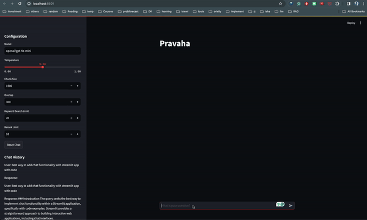
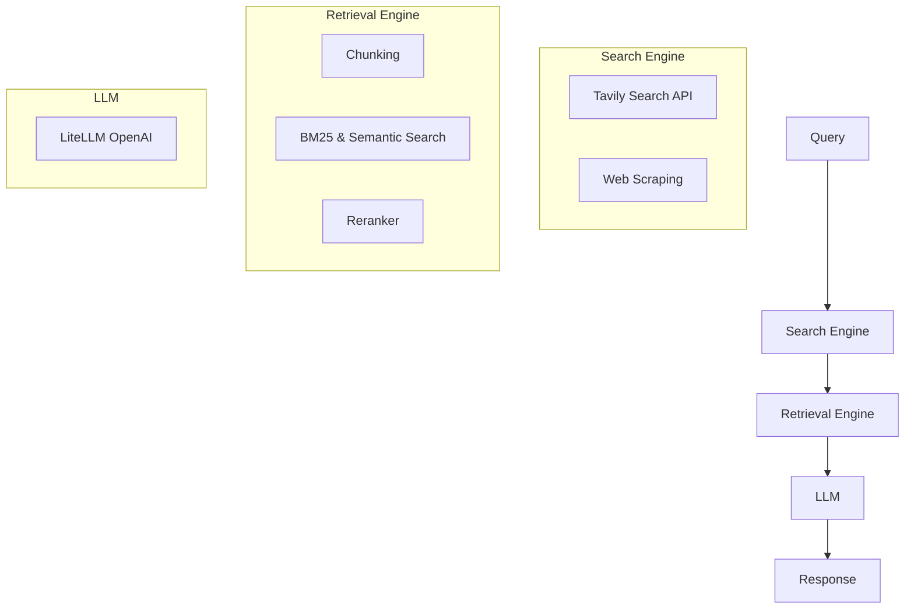

# Pravāha - Your Local Perplexity-Inspired Search Engine

**Introduction:**

Pravāha is your personal AI search assistant, bringing the power of a local search engine right to your fingertips. Inspired by Perplexity.ai, Pravāha lets you explore the fascinating world of Retrieval Augmented Generation (RAG) by combining cutting-edge search technology with the intelligence of Large Language Models (LLMs).



**Goal:**

Our mission is to empower users with a local, customizable, and insightful search experience. Pravāha aims to replicate the core functionality of popular search assistants like Perplexity, allowing you to delve deeper into information retrieval and language models.

**Explore the World of RAG:**

With Pravāha, you can witness firsthand how search engines and LLMs work in harmony. By understanding the underlying mechanisms of RAG, you can gain valuable insights into the future of information retrieval and AI-powered search.

**Key Features:**

* **Streamlit Web Interface:** Easy-to-use web application for interacting with Pravāha.
* **Advanced Reranking:** Utilizes the `answerdotai/reranker` library with FlashRank for improved result relevance.
* **Hybrid Search:** Combines BM25 and semantic search for comprehensive results.
* **LLM Integration:** Leverages OpenAI's language models through LiteLLM for intelligent responses.

**In Progress & Future Enhancements:**

Pravāha is constantly evolving! We are actively working on exciting new features, including:

* **Streaming Responses:** Experience real-time search results as they are generated. ✅
* **Expanded Search Tool Support:** Integrate with more search providers for a wider range of sources. ✅
* **Persistent Storage with DuckDB:** Store and manage your search history and data locally. ✅
* **Agentic RAG with LangGraph:** Explore the potential of agentic search and knowledge graphs. 
* **Customizable RAG Templates:** Create and share your own RAG templates (YAML) for unique search experiences.
* **UI Improvements**: Enhance the user interface for a more intuitive and engaging experience.
* **PRO Mode**: Unlock advanced features and settings for power users.()

**Name Inspiration:**

The name **Pravāha** (प्रवाह) is derived from Sanskrit, meaning "flow." This reflects the project's goal of creating a seamless flow of information and responses, allowing users to navigate through queries and context effortlessly. Just as a river flows smoothly, Pravāha aims to provide a fluid and intuitive search experience.

**System Architecture:**



## Getting Started

1. **Clone the repository**:
    ```sh
    git clone https://github.com/jayshah5696/pravaha.git
    cd pravaha
    ```

2. **Install dependencies**:
    - Using `pip`:
        ```sh
        pip install -r requirements.txt
        ```
    - Using `Poetry`:
        ```sh
        poetry install
        poetry shell
    ```

3. **Set up environment variables**:
    Create a `.env` file in the root directory and add your API keys. Depending on the models you wish to use, include the following keys:
    ```sh
    TVLY_API_KEY=your_tavily_api_key
    OPENAI_API_KEY=your_openai_api_key
    COHERE_API_KEY=your_cohere_api_key  # Add this if you want to use Cohere models
    ANTHROPIC_API_KEY=your_anthropic_api_key  # Add this if you want to use Anthropic models
    JINA_API_KEY=your_jina_api_key  # Add this if you want to use Jina reader api
    BRAVE_API_KEY=your_brave_api_key  # Add this if you want to use Brave search engine
    ```


4. **Set up DuckDB**:
    DuckDB is used for storing chat history. Install DuckDB using the following commands based on your operating system:

    - **macOS**:
        ```sh
        brew install duckdb
        ```

    - **Linux**:
        ```sh
        sudo apt-get install duckdb
        ```

    - **Windows**:
        ```sh
        winget install DuckDB.cli
        ```

    For more installation options, visit the [DuckDB Installation Guide](https://duckdb.org/docs/installation/).

5. **Run the Streamlit application**:
    ```sh
    streamlit run app.py
    ```

## File Overview

### `app.py`
Implements the Streamlit web interface for interacting with Pravāha.

### `prompts.py`
Generates prompt templates using Jinja2 for the RAG system.

### `main.py`
Handles the main application logic, including user input, search queries, and displaying results.

### `search.py`
Implements the search functionality using the Tavily API and web scraping.

### `retrieval.py`
Manages text chunking, embedding, and retrieval using BM25 and FAISS. Includes reranking functionality using FlashRank.

## Contributing

We welcome contributions to Pravāha! Please feel free to submit issues, feature requests, or pull requests to help improve the project.

## License

This project is licensed under the MIT License - see the [LICENSE](LICENSE) file for details or visit [MIT License](https://opensource.org/licenses/MIT).
