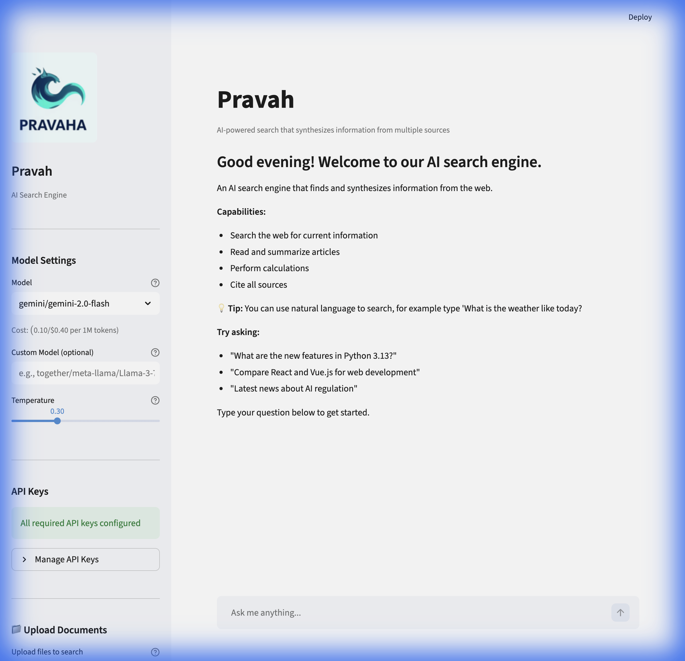

# Pravah v2

Pravah is a search-first chat app that combines web search, agent tools, local document search, and persistent chat history. The name means "flow" in Sanskrit.



## Highlights

- Search-first chat UI built with Streamlit
- Tavily web search and Gemini grounded search
- Page fetching, chunking, and memory search
- Local file uploads for `.txt`, `.md`, `.csv`, `.pdf`, `.docx`, `.pptx`, `.xlsx`
- Smart chat titles
- Dynamic welcome panel with API-key status
- Persistent conversation history in DuckDB
- Multi-provider LLM support via LiteLLM
- Evaluation runner and saved traces
- Safe `calculate` tool and hardened retrieval filters

## Quick start

### Prerequisites

- Python 3.11+
- `uv`

### Install

```bash
git clone https://github.com/jayshah5696/pravah.git
cd pravah
uv sync --group dev
```

### Configure

Create a `.env` file in the repo root:

```bash
TVLY_API_KEY=your_tavily_api_key

OPENAI_API_KEY=your_openai_api_key
ANTHROPIC_API_KEY=your_anthropic_api_key
GOOGLE_API_KEY=your_google_api_key
# or GEMINI_API_KEY=your_gemini_api_key
GROQ_API_KEY=your_groq_api_key
DEEPSEEK_API_KEY=your_deepseek_api_key
COHERE_API_KEY=your_cohere_api_key

LANGCHAIN_API_KEY=your_langsmith_api_key
LANGCHAIN_PROJECT=pravah
```

If you want to customize model choices or UI defaults, edit `config.yaml`.

### Run the app

```bash
uv run streamlit run app.py
```

Open `http://localhost:8501`.

## Testing

Run the full repo test suite:

```bash
uv run pytest tests -q
```

Current status in this branch: **49 tests passing**.

## Evaluation

```bash
uv run python scripts/eval.py
uv run python scripts/eval.py --limit 10
uv run python scripts/eval.py --model "gemini/gemini-2.0-flash"
```

Outputs are written to:
- `tests/eval_results.csv`
- `tests/traces/`

## Project structure

```text
.
├── app.py
├── config.yaml
├── docs/
├── pravah/
│   ├── agent.py
│   ├── history.py
│   ├── llm.py
│   ├── memory.py
│   ├── pricing.py
│   ├── prompts.py
│   ├── retrieval.py
│   ├── search.py
│   ├── titles.py
│   ├── tools.py
│   ├── uploads.py
│   └── welcome.py
├── scripts/
├── tests/
└── assets/
```

## Main tools

| Tool | Purpose |
|---|---|
| `web_search` | Search the web via Tavily |
| `gemini_search` | Grounded Gemini search |
| `fetch_page` | Read and summarize a page |
| `read_page_chunk` | Navigate long pages |
| `search_memory` | Search fetched page content |
| `search_uploads` | Search uploaded documents |
| `read_upload_chunk` | Read a full uploaded chunk |
| `calculate` | Safe math evaluation |

## Notes on uploads

- Simple text formats (`.txt`, `.md`, `.csv`, `.json`, `.html`) are parsed with lightweight built-in logic.
- Richer document types fall back to `markitdown`.
- Upload search is conversation-scoped and supports pagination.

## Development

```bash
uv sync --group dev
uv run pytest tests -q
uv run ruff check .
uv run ruff format .
```

## Docker

```bash
docker build -t pravah .
docker run -p 8501:8501 --env-file .env pravah
```

## License

MIT. See `LICENSE`.
