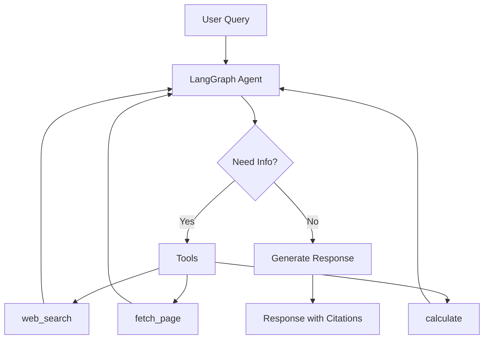

# Pravah v2 - AI Search Engine

**Pravah** (प्रवाह, meaning "flow" in Sanskrit) is an AI-powered search engine that synthesizes information from multiple web sources using agentic RAG (Retrieval Augmented Generation).


## What's New in v2

Pravah v2 is a complete rewrite with a modern agentic architecture:

- **LangGraph ReAct Agent**: Flexible agent loop with tool calling
- **Multi-Provider LLM Support**: OpenAI, Anthropic, Google Gemini, Groq, DeepSeek via LiteLLM
- **YAML Configuration**: Easy model and UI customization via `config.yaml`
- **Conversation History**: DuckDB-backed persistent chat history
- **Debug Panel**: Token usage, latency, and cost tracking
- **Streamlit UI**: Clean chat interface with tool visibility

## Features

- **Web Search**: Tavily-powered search with auto-summarization
- **Page Fetching**: Read and chunk long articles
- **Multi-Model**: Switch between 12+ models from 5 providers
- **Citations**: All responses include source citations
- **Streaming**: Real-time response display
- **History**: Browse and reload past conversations

## Quick Start

### Prerequisites

- Python 3.11+
- [uv](https://docs.astral.sh/uv/) (recommended) or pip

### Installation

```bash
# Clone the repository
git clone https://github.com/jayshah5696/pravah.git
cd pravah

# Install with uv (recommended)
uv sync

# Or with pip
pip install -e .
```

### Configuration

1. **Create `.env` file** with your API keys:

```bash
# Required for search
TVLY_API_KEY=your_tavily_api_key

# Add keys for the models you want to use:
OPENAI_API_KEY=your_openai_api_key
ANTHROPIC_API_KEY=your_anthropic_api_key
GEMINI_API_KEY=your_gemini_api_key
GROQ_API_KEY=your_groq_api_key
DEEPSEEK_API_KEY=your_deepseek_api_key

# Optional: LangSmith tracing
LANGCHAIN_API_KEY=your_langsmith_api_key
LANGCHAIN_PROJECT=pravah
```

2. **Customize models** (optional) - Edit `config.yaml`:

```yaml
defaults:
  model: "gemini/gemini-2.0-flash"
  temperature: 0.3

models:
  - name: "openai/gpt-4o"
    description: "Most capable OpenAI model"
  - name: "gemini/gemini-2.0-flash"
    description: "Fast Gemini model"
  # Add more models...
```

### Run

```bash
# With uv
uv run streamlit run app.py

# Or with pip
streamlit run app.py
```

Open http://localhost:8501 in your browser.

## Project Structure

```
pravah/
├── app.py                 # Streamlit UI
├── config.yaml            # Model and UI configuration
├── pravah/
│   ├── agent.py           # LangGraph ReAct agent
│   ├── tools.py           # Agent tools (search, fetch, calculate)
│   ├── prompts.py         # System prompts
│   ├── history.py         # DuckDB conversation storage
│   ├── search.py          # Search providers
│   ├── retrieval.py       # Chunking and reranking
│   └── llm.py             # LLM utilities
├── scripts/
│   └── eval.py            # Evaluation framework
├── tests/
│   └── eval_set.csv       # Test dataset (38 cases)
├── .streamlit/
│   └── config.toml        # Streamlit theme
└── docs/
    └── EVAL_GUIDE.md      # Evaluation documentation
```

## Available Models

| Provider | Models | API Key |
|----------|--------|---------|
| OpenAI | gpt-4o, gpt-4o-mini, o3-mini | `OPENAI_API_KEY` |
| Anthropic | claude-sonnet-4, claude-3-5-haiku | `ANTHROPIC_API_KEY` |
| Google | gemini-2.0-flash, gemini-1.5-pro | `GEMINI_API_KEY` |
| Groq | llama-3.3-70b, llama-3.1-8b | `GROQ_API_KEY` |
| DeepSeek | deepseek-chat | `DEEPSEEK_API_KEY` |

## Agent Tools

| Tool | Description |
|------|-------------|
| `web_search` | Search the web via Tavily |
| `fetch_page` | Fetch and extract content from URLs |
| `read_page_chunk` | Navigate long documents in chunks |
| `search_memory` | Search previously fetched content |
| `calculate` | Evaluate mathematical expressions |

## Evaluation

Run the evaluation suite:

```bash
# Run all 38 test cases
uv run python scripts/eval.py

# Run a subset
uv run python scripts/eval.py --limit 10

# See detailed results
uv run python scripts/eval.py --verbose
```

Expected results: ~84% pass rate, 0 errors.

## Docker

```bash
# Build
docker build -t pravah .

# Run
docker run -p 8501:8501 --env-file .env pravah
```

## Architecture


```mermaid
flowchart TD
    A[User Query] --> B[LangGraph Agent]
    B --> C{Need Info?}
    C -->|Yes| D[Tools]
    C -->|No| E[Generate Response]
    D --> F[web_search]
    D --> G[fetch_page]
    D --> H[calculate]
    F --> B
    G --> B
    H --> B
    E --> I[Response with Citations]
```

## Development

```bash
# Install dev dependencies
uv sync --group dev

# Run tests
uv run pytest

# Lint
uv run ruff check .

# Format
uv run ruff format .
```

## Contributing

Contributions welcome! Please:

1. Fork the repository
2. Create a feature branch
3. Run tests and linting
4. Submit a pull request

## License

MIT License - see [LICENSE](LICENSE) for details.

## Acknowledgments

- [LangGraph](https://github.com/langchain-ai/langgraph) - Agent framework
- [LiteLLM](https://github.com/BerriAI/litellm) - Multi-provider LLM interface
- [Tavily](https://tavily.com/) - Search API
- [Streamlit](https://streamlit.io/) - UI framework
